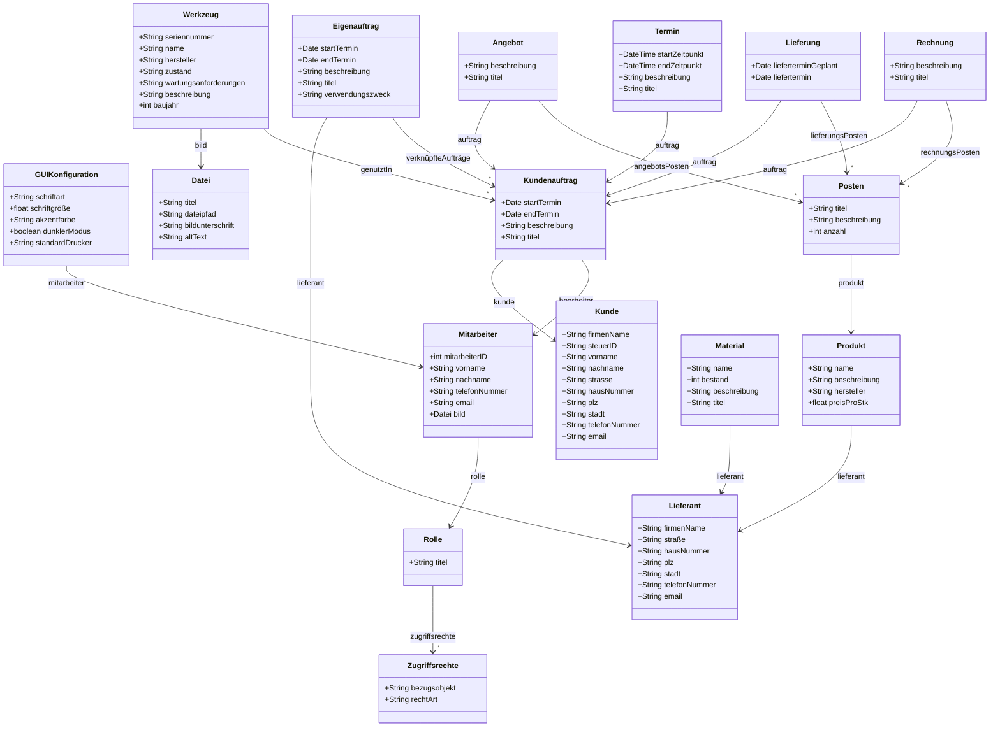

```mermaid
classDiagram
direction td
%% --- Mitarbeiter, Rolle, Zugriffsrechte ---
class Mitarbeiter {
  +int mitarbeiterID
  +String vorname
  +String nachname
  +String telefonNummer
  +String email
  +Datei bild
}
class Rolle {
  +String titel
}
class Zugriffsrechte {
  +String bezugsobjekt
  +String rechtArt
}
Mitarbeiter --> Rolle : rolle
Rolle --> "*" Zugriffsrechte : zugriffsrechte
%% --- GUI-Konfiguration ---
class GUIKonfiguration {
  +String schriftart
  +float schriftgröße
  +String akzentfarbe
  +boolean dunklerModus
  +String standardDrucker
}
GUIKonfiguration --> Mitarbeiter : mitarbeiter
%% --- Datei ---
class Datei {
  +String titel
  +String dateipfad
  +String bildunterschrift
  +String altText
}
%% --- Lieferanten ---
class Lieferant {
  +String firmenName
  +String straße
  +String hausNummer
  +String plz
  +String stadt
  +String telefonNummer
  +String email
}
%% --- Kunden ---
class Kunde {
  +String firmenName
  +String steuerID
  +String vorname
  +String nachname
  +String strasse
  +String hausNummer
  +String plz
  +String stadt
  +String telefonNummer
  +String email
}
%% --- Kundenaufträge ---
class Kundenauftrag {
  +Date startTermin
  +Date endTermin
  +String beschreibung
  +String titel
}
Kundenauftrag --> Kunde : kunde
Kundenauftrag --> Mitarbeiter : bearbeiter
%% --- Eigenauftrag ---
class Eigenauftrag {
  +Date startTermin
  +Date endTermin
  +String beschreibung
  +String titel
  +String verwendungszweck
}
Eigenauftrag --> Lieferant : lieferant
Eigenauftrag --> "*" Kundenauftrag : verknüpfteAufträge
%% --- Angebote ---
class Angebot {
  +String beschreibung
  +String titel
}
Angebot --> Kundenauftrag : auftrag
Angebot --> "*" Posten : angebotsPosten
%% --- Lieferungen ---
class Lieferung {
  +Date lieferterminGeplant
  +Date liefertermin
}
Lieferung --> Kundenauftrag : auftrag
Lieferung --> "*" Posten : lieferungsPosten
%% --- Rechnungen ---
class Rechnung {
  +String beschreibung
  +String titel
}
Rechnung --> Kundenauftrag : auftrag
Rechnung --> "*" Posten : rechnungsPosten
%% --- Posten & Produkt ---
class Posten {
  +String titel
  +String beschreibung
  +int anzahl
}
class Produkt {
  +String name
  +String beschreibung
  +String hersteller
  +float preisProStk
}
Posten --> Produkt : produkt
Produkt --> Lieferant : lieferant
%% --- Termin ---
class Termin {
  +DateTime startZeitpunkt
  +DateTime endZeitpunkt
  +String beschreibung
  +String titel
}
Termin --> Kundenauftrag : auftrag
%% --- Material ---
class Material {
  +String name
  +int bestand
  +String beschreibung
  +String titel
}
Material --> Lieferant : lieferant
%% --- Werkzeug ---
class Werkzeug {
  +String seriennummer
  +String name
  +String hersteller
  +String zustand
  +String wartungsanforderungen
  +String beschreibung
  +int baujahr
}
Werkzeug --> Datei : bild
Werkzeug --> "*" Kundenauftrag : genutztIn
```
