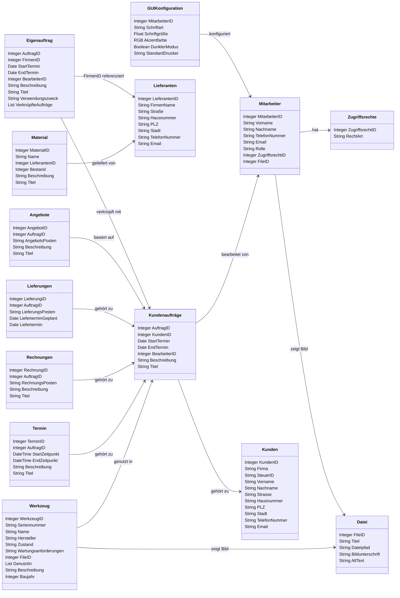

```mermaid
classDiagram
    direction LR  %% or TB (top to bottom)
    class Mitarbeiter {
        Integer MitarbeiterID
        String Vorname
        String Nachname
        String TelefonNummer
        String Email
        String Rolle
        Integer ZugriffsrechtID
        Integer FileID
    }

    class GUIKonfiguration {
        Integer MitarbeiterID
        String Schriftart
        Float Schriftgröße
        RGB Akzentfarbe
        Boolean DunklerModus
        String StandardDrucker
    }

    class Zugriffsrechte {
        Integer ZugriffsrechtID
        String RechtArt
    }

    class Lieferanten {
        Integer LieferantenID
        String FirmenName
        String Straße
        String Hausnummer
        String PLZ
        String Stadt
        String TelefonNummer
        String Email
    }

    class Kunden {
        Integer KundenID
        String Firma
        String SteuerID
        String Vorname
        String Nachname
        String Strasse
        String Hausnummer
        String PLZ
        String Stadt
        String TelefonNummer
        String Email
    }

    class Kundenaufträge {
        Integer AuftragID
        Integer KundenID
        Date StartTermin
        Date EndTermin
        Integer BearbeiterID
        String Beschreibung
        String Titel
    }

    class Eigenauftrag {
        Integer AuftragID
        Integer FirmenID
        Date StartTermin
        Date EndTermin
        Integer BearbeiterID
        String Beschreibung
        String Titel
        String Verwendungszweck
        List<Integer> VerknüpfteAufträge
    }

    class Angebote {
        Integer AngebotID
        Integer AuftragID
        String AngebotsPosten
        String Beschreibung
        String Titel
    }

    class Lieferungen {
        Integer LieferungID
        Integer AuftragID
        String LieferungsPosten
        Date LieferterminGeplant
        Date Liefertermin
    }

    class Rechnungen {
        Integer RechnungID
        Integer AuftragID
        String RechnungsPosten
        String Beschreibung
        String Titel
    }

    class Termin {
        Integer TerminID
        Integer AuftragID
        DateTime StartZeitpunkt
        DateTime EndZeitpunkt
        String Beschreibung
        String Titel
    }

    class Material {
        Integer MaterialID
        String Name
        Integer LieferantenID
        Integer Bestand
        String Beschreibung
        String Titel
    }

    class Werkzeug {
        Integer WerkzeugID
        String Seriennummer
        String Name
        String Hersteller
        String Zustand
        String Wartungsanforderungen
        Integer FileID
        List<Integer> GenutztIn
        String Beschreibung
        Integer Baujahr
    }

    class Datei {
        Integer FileID
        String Titel
        String Dateipfad
        String Bildunterschrift
        String AltText
    }

    %% Relationships
    Mitarbeiter --> Zugriffsrechte : hat
    Mitarbeiter --> Datei : zeigt Bild
    GUIKonfiguration --> Mitarbeiter : konfiguriert
    Kundenaufträge --> Kunden : gehört zu
    Kundenaufträge --> Mitarbeiter : bearbeitet von
    Eigenauftrag --> Lieferanten : FirmenID referenziert
    Eigenauftrag --> Kundenaufträge : verknüpft mit
    Angebote --> Kundenaufträge : basiert auf
    Lieferungen --> Kundenaufträge : gehört zu
    Rechnungen --> Kundenaufträge : gehört zu
    Termin --> Kundenaufträge : gehört zu
    Material --> Lieferanten : geliefert von
    Werkzeug --> Kundenaufträge : genutzt in
    Werkzeug --> Datei : zeigt Bild
```
