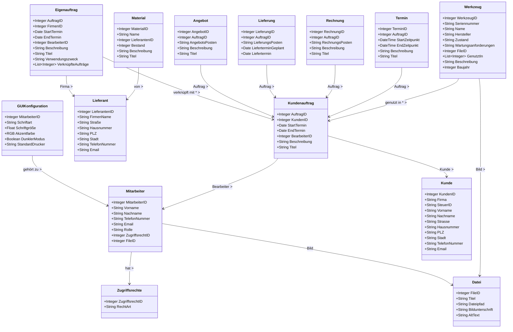

```mermaid
classDiagram
%% Klassen
class Mitarbeiter {
  +Integer MitarbeiterID
  +String Vorname
  +String Nachname
  +String TelefonNummer
  +String Email
  +String Rolle
  +Integer ZugriffsrechtID
  +Integer FileID
}

class GUIKonfiguration {
  +Integer MitarbeiterID
  +String Schriftart
  +Float Schriftgröße
  +RGB Akzentfarbe
  +Boolean DunklerModus
  +String StandardDrucker
}

class Zugriffsrechte {
  +Integer ZugriffsrechtID
  +String RechtArt
}

class Lieferant {
  +Integer LieferantenID
  +String FirmenName
  +String Straße
  +String Hausnummer
  +String PLZ
  +String Stadt
  +String TelefonNummer
  +String Email
}

class Kunde {
  +Integer KundenID
  +String Firma
  +String SteuerID
  +String Vorname
  +String Nachname
  +String Strasse
  +String Hausnummer
  +String PLZ
  +String Stadt
  +String TelefonNummer
  +String Email
}

class Kundenauftrag {
  +Integer AuftragID
  +Integer KundenID
  +Date StartTermin
  +Date EndTermin
  +Integer BearbeiterID
  +String Beschreibung
  +String Titel
}

class Eigenauftrag {
  +Integer AuftragID
  +Integer FirmenID
  +Date StartTermin
  +Date EndTermin
  +Integer BearbeiterID
  +String Beschreibung
  +String Titel
  +String Verwendungszweck
  +List~Integer~ VerknüpfteAufträge
}

class Angebot {
  +Integer AngebotID
  +Integer AuftragID
  +String AngebotsPosten
  +String Beschreibung
  +String Titel
}

class Lieferung {
  +Integer LieferungID
  +Integer AuftragID
  +String LieferungsPosten
  +Date LieferterminGeplant
  +Date Liefertermin
}

class Rechnung {
  +Integer RechnungID
  +Integer AuftragID
  +String RechnungsPosten
  +String Beschreibung
  +String Titel
}

class Termin {
  +Integer TerminID
  +Integer AuftragID
  +DateTime StartZeitpunkt
  +DateTime EndZeitpunkt
  +String Beschreibung
  +String Titel
}

class Material {
  +Integer MaterialID
  +String Name
  +Integer LieferantenID
  +Integer Bestand
  +String Beschreibung
  +String Titel
}

class Werkzeug {
  +Integer WerkzeugID
  +String Seriennummer
  +String Name
  +String Hersteller
  +String Zustand
  +String Wartungsanforderungen
  +Integer FileID
  +List~Integer~ GenutztIn
  +String Beschreibung
  +Integer Baujahr
}

class Datei {
  +Integer FileID
  +String Titel
  +String Dateipfad
  +String Bildunterschrift
  +String AltText
}

%% Assoziationen
Mitarbeiter --> Zugriffsrechte : hat >
Mitarbeiter --> Datei : Bild
GUIKonfiguration --> Mitarbeiter : gehört zu >
Kundenauftrag --> Kunde : Kunde >
Kundenauftrag --> Mitarbeiter : Bearbeiter >
Eigenauftrag --> Lieferant : Firma >
Eigenauftrag --> Kundenauftrag : verknüpft mit * >
Angebot --> Kundenauftrag : Auftrag >
Lieferung --> Kundenauftrag : Auftrag >
Rechnung --> Kundenauftrag : Auftrag >
Termin --> Kundenauftrag : Auftrag >
Material --> Lieferant : von >
Werkzeug --> Kundenauftrag : genutzt in * >
Werkzeug --> Datei : Bild >
```
